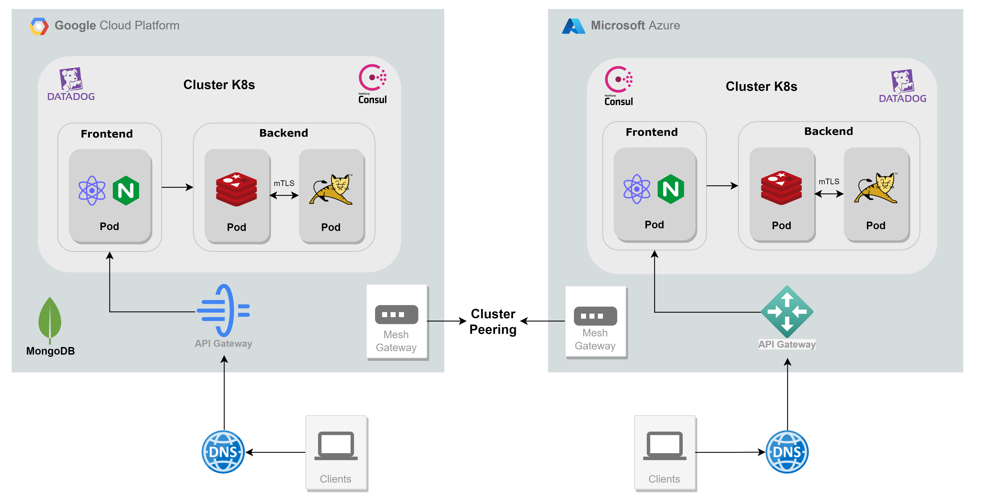

# **Schedule Application**
## General info
This repository contains the Class Schedule Project made by **Blue Team**.

## Diagram 


<!--  -->

## Application Stack

- React
- Java (11)
- Gradle (7)
- Tomcat (9)
- PostgreSQL (15)
- MongoDB:latest
- Redis:latest
- Docker:latest

# **Development environment**
## Start application

    docker compose -f docker-compose-deps.yml -docker-compose-dev.yml --env-file .env.dev up

## Environment variables
You should provide file **`.env.dev`** inside project
```bash
## Postgres configuration

# Application connection strings
POSTGRES_DATABASE=schedule
POSTGRES_TEST_DATABASE=schedule_test
POSTGRES_URL=jdbc:postgresql://postgres:5432/$POSTGRES_DATABASE
POSTGRES_TEST_URL=jdbc:postgresql://postgres:5432/$POSTGRES_TEST_DATABASE

# Application user
POSTGRES_ADMIN=schedule
POSTGRES_ADMIN_PASSWORD=9h4m03JQURp7

# Postgres container user
POSTGRES_USER=postgres
POSTGRES_PASSWORD=9h4m03JQURp7

# Containers ports
SCHEDULE_APP_PORT=8888
SCHEDULE_WEP_PORT=3000

## Redis configuration
REDIS_URL=redis://redis:6379
REDIS_PORT=6379
REDIS_DATABASES=16

## Mongo configuration
MONGO_DATABASE=schedules
MONGO_URL=mongo
MONGO_INITDB_ROOT_USERNAME=root
MONGO_INITDB_ROOT_PASSWORD=4MMq0fDOf8sY

## JWT configuration
JWT_TOKEN=jwttoken
JWT_EXPIRED=86400000
```

## Restore the database data using dump file
To restore database data, create a file named **initial_data.dump** inside the **/ClassSchedule/backup** folder.


# **Stage and production environment**
## Installing Vagrant
To install **Vagrant**, visit [Vagrant Installation](https://developer.hashicorp.com/vagrant/install).

## Verify Vagrant Version
Ensure that Vagrant is correctly installed by running the following command:

    vagrant --version


## VM Provider
You need to download a VM Provider of your choice from the options below:

- [VirtualBox](https://www.virtualbox.org)
- [VMware Workstation Player](https://www.vmware.com/products/workstation-player/workstation-player-evaluation.html)


## Changing VM Provider inside Vagrantfile
In **Vagrantfile**, replace the default **VM Provider** with one you have chosen:

    VM_PROVIDER = <your-vm-provider>

## Start the Environment:
### For Stage Environment:

    vagrant up stage
### For Production Environment:

    vagrant up prod

# **Ansible** 
### Explore Our Ansible Automation repository

Leverage Ansible for streamlined **configuration management** and **automation** tasks in our project. Simplify infrastructure deployment and management through code.

You can explore and contribute to our Ansible automation scripts by visiting our **GitHub Repository**:

### *[Ansible Repository](https://github.com/BlueTeam2/awx-ansible)*

# **Terraform**
### Explore Our Terraform Infrastructure as Code (IaC) repository

We're **migrated** on **Terragrunt** now, Terraform was for **Demo 2**. 
You can explore and contribute to our Terraform codebase by visiting our **GitHub Repository**:

### *[Terraform Repository](https://github.com/BlueTeam2/terraform-live.git)*

# **Terragrunt**
### Explore Our Terragrunt Infrastructure as Code (IaC) repository

For managing infrastructure in our project, we now employ Terragrunt. You can explore and contribute to our Terragrunt codebase by visiting our **GitHub Repository**:

### *[Terragrunt Repository](https://github.com/BlueTeam2/terragrunt-live.git)*

# **Frontend**
### Explore Our Frontend repository

We've split our application into **Frontend** and **Backend** parts. The Frontend part has been moved to a new repository named ***class-schedule-frontend***, while Backend part remains in the **ClassSchedule** repository.

### *[Frontend Repository](https://github.com/BlueTeam2/class-schedule-frontend)*

# **Class-schedule-k8s**

### Explore class-schedule-k8s repository
This repository is specified for managing a **Kubernetes cluster**. It includes Helm charts and Consul for peering our clusters across diferrent clouds. Visit our **GitHub Repository**:

### *[Class-schedule-k8s Repository](https://github.com/BlueTeam2/class-schedule-k8s.git)*