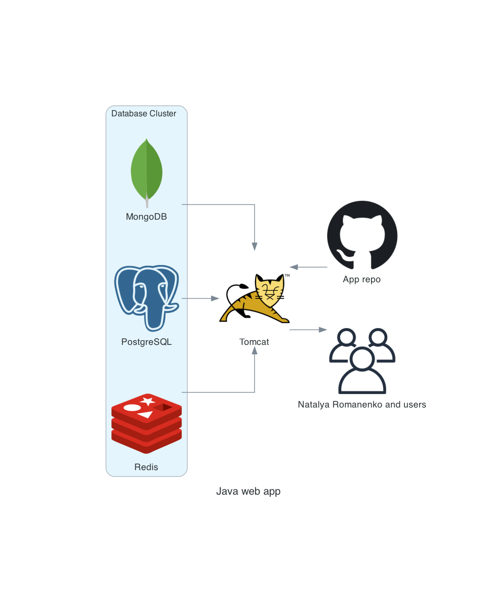

# Class chedule
## General info
This repository contains a source code of the Class Schedule Project.
The main goal of the project is designing a website where the university or institute staff will be able to create, store and display their training schedules.

## Diagram 



## First, download and install Vagrant on your system. You can use the following commands to install Vagrant on a Debian-based system:

Copy code
`wget https://releases.hashicorp.com/vagrant/2.2.19/vagrant_2.2.19_x86_64.deb`
`sudo apt install ./vagrant_2.2.19_x86_64.deb`
Verify Vagrant Installation and Install Vagrant Plugin

## After installation, verify that Vagrant is correctly installed with:

Copy code
`vagrant --version`
Additionally, install the vagrant-docker-compose plugin:

Copy code
`vagrant plugin install vagrant-docker-compose`
## Create .env.stage and .env.prod
# .env.stage
```
#Postgres configuration
POSTGRES_URL=jdbc:postgresql://postgres:5432/YOUR_POSTGRES_DATABASE
POSTGRES_DATABASE=YOUR_POSTGRES_DATABASE

POSTGRES_TEST_URL=jdbc:postgresql://postgres:5432/YOUR_POSTGRES_TEST_DATABASE
POSTGRES_TEST_DATABASE=YOUR_POSTGRES_TEST_DATABASE

POSTGRES_ADMIN_USERNAME=YOUR_POSTGRES_ADMIN_USERNAME
POSTGRES_ADMIN_PASSWORD=YOUR_POSTGRES_ADMIN_PASSWORD

POSTGRES_USER=YOUR_USER
POSTGRES_PASSWORD=YOUR_POSTGRES_PASSWORD

# Redis configuration
REDIS_URL=redis://redis:6379
REDIS_PORT=6379
REDIS_DATABASES=16

# Mongo configuration
MONGO_DATABASE=YOUR_MONGO_DATABASE
MONGO_URL=mongo
MONGO_INITDB_ROOT_USERNAME=YOUR_MONGO_INITDB_ROOT_USERNAME
MONGO_INITDB_ROOT_PASSWORD=YOUR_MONGO_INITDB_ROOT_PASSWORD

# JWT configuration
JWT_TOKEN=jwttoken
JWT_EXPIRED=86400000
```
# .env.prod
```
# Postgres configuration
POSTGRES_URL=jdbc:postgresql://postgres:5432/YOUR_POSTGRES_DB
POSTGRES_USER=YOUR_POSTGRES_USER
POSTGRES_PASSWORD=YOUR_POSTGRES_PASSWORD
POSTGRES_DB=YOUR_POSTGRES_DB

# Redis configuration
REDIS_URL=redis://redis:6379
REDIS_PORT=6379
REDIS_DATABASES=16

# Mongo configuration
MONGO_DATABASE=YOUR_MONGO_DATABASE
MONGO_URL=mongo
MONGO_INITDB_ROOT_USERNAME=YOUR_MONGO_INITDB_ROOT_USERNAME
MONGO_INITDB_ROOT_PASSWORD=YOUR_MONGO_INITDB_ROOT_PASSWORD

# JWT configuration
JWT_TOKEN=jwttoken
JWT_EXPIRED=86400000

```
## Dump for DB

You need initial_data.dump for DB in environments folder!!!

## Starting the App
To start the application in either a staging (stage) or production (prod) environment, follow these steps:

Launch the application using Vagrant:

## For the staging environment:

Copy code
`vagrant up stage`
## For the production environment:

Copy code
`vagrant up prod`

Please note that you may need to configure your Vagrantfile and Docker Compose settings to match your project requirements and dependencies. Make sure to check the project's documentation for any additional setup or configuration steps.
